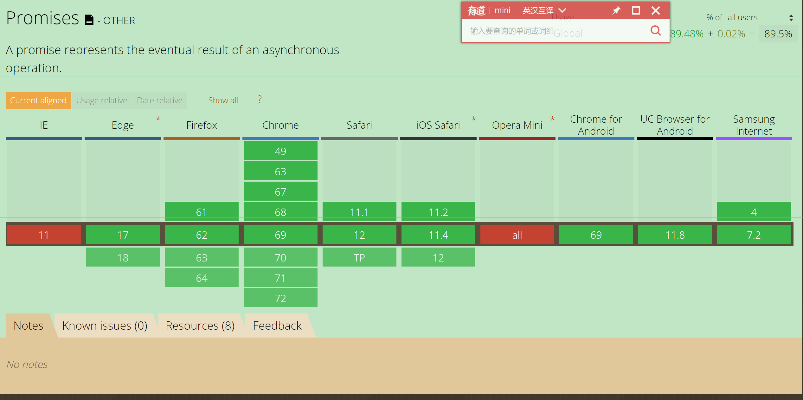
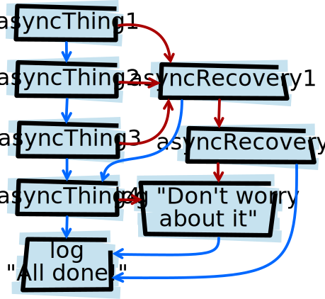

# Promise 

> Promise晋级，需要的全部都在这
>
> 主要内容：
>
> 1. promise基本实现原理
> 2. promise 使用中难点（链式调用，API基本上返回都是一个新Promise，及参数传递）
> 3. promise 对异常处理
> 4. promise 简单实现及规范
>
> 参考：
>
> ​	[30分钟，让你彻底明白Promise原理](https://segmentfault.com/a/1190000009478377) 
>
> ​	[阮一峰ES6入门](http://es6.ruanyifeng.com/#docs/promise) 
>
> ​	[JavaScript Promise：简介](https://developers.google.com/web/fundamentals/primers/promises?hl=zh-cn#_4)

## 0. 基本用法

基本的promise使用，读本文需要了解基本的`Promise`使用。

#### 1. 兼容性

[查看caniuse](https://caniuse.com/#search=Promise)



查兼容性 基本上 主流浏览器支持没有问题。

IE不兼容 问题，本文不予以处理，出门左转，找谷哥。具体查看 [babel](https://babeljs.io/docs/en/babel-polyfill)，或者 自己实现一个Promise

#### 2. ajax  XMLHttpRequest封装

```javascript
//get 请求封装
function get(url) {
  // Return a new promise.
  return new Promise(function(resolve, reject) {
    // Do the usual XHR stuff
    var req = new XMLHttpRequest();
    req.open('GET', url);

    req.onload = function() {
      // This is called even on 404 etc
      // so check the status
      if (req.status == 200) {
        // Resolve the promise with the response text
        resolve(req.response);
      }
      else {
        // Otherwise reject with the status text
        // which will hopefully be a meaningful error
        reject(Error(req.statusText));
      }
    };

    // Handle network errors
    req.onerror = function() {
      reject(Error("Network Error"));
    };

    // Make the request
    req.send();
  });
}
```


## 1. Promse API

   Promise API 分为 :[MDN](https://developer.mozilla.org/zh-CN/docs/Web/JavaScript/Reference/Global_Objects/Promise/then#%E8%BF%94%E5%9B%9E%E5%80%BC)

> 这里不大段罗列API 只拿then来深入聊聊。（目录结构是告诉分为静态方法及prototype上的方法，具体不同参考JavaScript原型链）

#### 1.静态方法

#### 2.`prototype`上方法

1. `Promise.prototype.then()` 来分析

```
首先来看看 `Promise.prototype.then()`返回一个`Promise`,但`Promise`内部有返回值，且 返回值，可以是个值，也可能就是一个新`Promise`
```

  *具体规则如下：*

    - *如果then中的回调函数返回一个值，那么then返回的Promise将会成为接受状态，并且将返回的值作为接受状态的回调函数的参数值。*
    - *如果then中的回调函数抛出一个错误，那么then返回的Promise将会成为拒绝状态，并且将抛出的错误作为拒绝状态的回调函数的参数值。*
    - *如果then中的回调函数返回一个已经是接受状态的Promise，那么then返回的Promise也会成为接受状态，并且将那个Promise的接受状态的回调函数的参数值作为该被返回的Promise的接受状态回调函数的参数值。*
    - *如果then中的回调函数返回一个已经是拒绝状态的Promise，那么then返回的Promise也会成为拒绝状态，并且将那个Promise的拒绝状态的回调函数的参数值作为该被返回的Promise的拒绝状态回调函数的参数值。*
    - *如果then中的回调函数返回一个未定状态（pending）的Promise，那么then返回Promise的状态也是未定的，并且它的终态与那个Promise的终态相同；同时，它变为终态时调用的回调函数参数与那个Promise变为终态时的回调函数的参数是相同的。*
    
    **上面是官方规则，神马，具体白话就是 核心是 返回参数及返回promise的状态**
    
    参考：[MDN](https://developer.mozilla.org/zh-CN/docs/Web/JavaScript/Reference/Global_Objects/Promise/then#%E8%BF%94%E5%9B%9E%E5%80%BC)
    
    是不是 觉得很晕，没关系，可以先看 下一节，看完后，再回过来看具体的说明

```javascript
/*then 回调中，
	1. 返回是return function,则返回一个Promise 【参见对比3代码】
	2. 不是一个function,则 then 将创建一个没有经过回调函数处理的新 Promise 对象，这个新 Promise 只是简单地接受调用这个 then 的原 Promise 的终态作为它的终态。（MDN中解释）【参见对比1代码】
	3. 返回一个function，但没有return ，则相当于 then(null)
  */
//对比1 穿透问题  返回是'foo' 而不是 'bar'
Promise.resolve('foo')
    .then(Promise.resolve('bar'))
    .then(function(result){
    	console.log(result)
	})


//对比2  打印undefined
Promise.resolve('foo')
    .then(function(){Promise.resolve('bar')})
    .then(function(result){
        console.log(result)
    })
 

//对比3  返回 'bar'
Promise.resolve('foo')
    .then(function() {
        return Promise.resolve('bar')
    }).then(function(result) {
        console.log(result)
    })
```


## 2. Prmise 链式调用——重点（难点）

> 链式调用
>
>    	1.   核心就是 then catch 等方法返回一个Promise
>    	2.   链式 调用数据传递（注意）

#### 1. 值传递问题

简单例子

   ```javascript
   //正常状态
   const promise1 = new Promise((resolve, reject) => {
       resolve('0000')//
   })
   promise1.then(result => {
       console.log(result) //0000
   	   return '1111';//类似于 return Promise.resolve('1111'); 参数是data，promise 状态时 resolve
   }).then(data => {
       console.log(data) // 1111
   })
   ```

一个实际的例子:（拿来大神的例子[JavaScript Promise：简介](https://developers.google.com/web/fundamentals/primers/promises?hl=zh-cn#_4)）

```javascript
//step 0
get('story.json').then(function(response) {
  console.log("Success!", response);
})
```

```javascript
//step 1
//这里的 response 是 JSON，但是我们当前收到的是其纯文本。也可以设置XMLHttpRequest.responseType =json
get('story.json').then(function(response) {
  return JSON.parse(response);
}).then(function(response) {
  console.log("Yey JSON!", response);
})
```

```javascript
//step 2
//由于 JSON.parse() 采用单一参数并返回改变的值，因此我们可以将其简化为：
get('story.json').then(JSON.parse).then(function(response) {
  console.log("Yey JSON!", response);
})
```

```javascript
//step 3
function getJSON(url) {
  return get(url).then(JSON.parse);
}
//getJSON() 仍返回一个 promise，该 promise 获取 URL 后将 response 解析为 JSON。
```

#### 2. 异步操作队列

上面至今是`return 值 `，直接调用 下一下`then`就OK了。

但如果`return Promise`,则？

```javascript
Promise.resolve(111).then(function(d){
	console.log(d);
	return Promise.resolve(d+111);//返回promise
}).then(function(d2){
	console.log(d2);
})
// 111,222
```

#### 3. 链式调用异常处理

参见后文，异常处理。


## 3. 并行问题forEach处理

上面是多个链式调用，下面聊聊 并行处理

当多个异步并行执行时，每个异步代码执行时间不定，所以多个异步执行结束时间无法确定（无法确定结束完时间）。

所以需要特殊处理。

```javascript
//forEach 顺便无法保证
var arrs = [1,2,3,4];
var p = function(d){
	return new Promise((resolve)=>{
       setTimeout(()=>{
			resolve(d);
		},Math.random()*1000);//因为异步执行时间无法确认
    });
};
arrs.forEach(function(arr){
  p(arr).then((d)=>{
    console.log(d);
  })
});
```

```javascript
//使用 Promise.all 来让返回有序
var arrs = [1,2,3,4];
var p = function(d){
	return new Promise((resolve)=>{
       setTimeout(()=>{
			resolve(d);
		},Math.random()*1000);//因为异步执行时间无法确认
    });
};
var ps = [];
arrs.forEach(function(arr){
  ps.push(p(arr));
});
Promise.all(ps).then(values=>{
  console.log(values);//[1,2,3,4]
})
```


## 4. 基本实现原理—实现一个简单Promise

自己手撸一个简单的`Promise`

#### 1. 版本1—极简实现

   ```javascript
//版本1 极简实现
function Promise1(fn) {
    var value = null,
        callbacks = [];  //callbacks为数组，因为可能同时有很多个回调

    this.then = function (onFulfilled) {
        callbacks.push(onFulfilled);
        return this;//支持链式调用 Promise.then().then
    };

    function resolve(value) {
        callbacks.forEach(function (callback) {
            callback(value);
        });
    }

    fn(resolve);
}
//Test 对上面实现，写一个简单的测试
new Promise1(function(resolve){
    setTimeout(function(){
        resolve(1);
    },100);
}).then(function(d){
    console.log(d);
})
//1
   ```

#### 2. 版本2—加入延时机制

```javascript
//上面版本1 可能导致问题
//在then注册回调之前，resolve就已经执行了
new Promise1(function(resolve){
    console.log(0)
	resolve(1);
}).then(function(d){
   console.log(d);
})
// 1 不会打印
```

```javascript
//版本2 解决
function Promise1(fn) {
    var value = null,
        callbacks = [];  //callbacks为数组，因为可能同时有很多个回调

    this.then = function (onFulfilled) {
        callbacks.push(onFulfilled);
        return this;//支持链式调用 Promise.then().then
    };

    function resolve(value) {
       setTimeout(function(){
        callbacks.forEach(function (callback) {
            callback(value);
        }),0});
    }

    fn(resolve);
}
```

#### 3. 版本3—状态

`Promise`有三种状态`pending`、`fulfilled`、`rejected` ，且状态变化时单向的。

具体细节就是 在`then`,`resolve`中加状态判断，具体代码略

#### 4. Promises/A+

具体 `Promise`实现有一套官方规范，具体参见[Promises/A+](https://promisesaplus.com/)


## 5. finnaly 实现

   ```javascript
//版本一 finnaly 表示，不管resolve,reject 都执行   
   Promise.prototype.finally = function (callback) {
     let P = this.constructor;
     return this.then(
       value  => P.resolve(callback()).then(() => value),
       reason => P.resolve(callback()).then(() => { throw reason })
     );
   };
   ```

```javascript
//版本二
Promise.prototype.finally = function (callback) {
     return this.then(//这个 必须是this.then 而不是 Promise.prototype.then
       value  => Promise.resolve(callback()).then(() => value),
       reason => Promise.resolve(callback()).then(() => { throw reason })
     );
   };
```

版本一 版本二 两种不同的写法，各有利弊。具体参见 JavaScript原型链

```javascript
//test
Promise.resolve(1).finally((d)=>{console.log(d)})
Promise.reject(1).finally((d)=>{console.log(d)})
```


## 6. 异常处理

>   异常分类：
>
>   1. 同步异常
>   2. 异步异常 无法`try-catch` 得到
>   3. 多层Promise嵌套，获异常取具体的一个promise异常，而不是全部

#### 0. try-catch 无法捕获异步异常

> 因为异步的执行上下文 与try-catch 不是同一个，所以无法捕获

```javascript
//一个简单例子
try{
  Promise.reject(2)
}catch(e){
 console.log(11111111)
}
//VM1279:2 Uncaught (in promise) 2
```

#### 1. Promise 异常处理基本套路

基本处理异常中，有两种方案`then(undefined, func)`  与`catch()`

但`then(undefined, func)`  与`catch()`**不同**，具体参见代码**方案3**

```javascript
//方案1 使用 Promise.prototype.catch()来catch
const promise1 = new Promise((resolve, reject) => {
    reject('no')// 
})
promise1.then(result => {
    console.log(result) // 永远不会执行
}).catch(error => {
    console.log(error) // no
})
```

```javascript
//方案2 使用 Promise.prototype.then()中第二个参数 来处理
const promise1 = new Promise((resolve, reject) => {
    reject('no')// 
})
promise1.then(result => {
    console.log(result) // 永远不会执行
}，error => {
    console.log(error) // no
})
```

```javascript
//方案2  （方案1  方案2 对比）
var promise2 = new Promise((resolve, reject) => {
    resolve('yes')// 
})
promise2.then(result => {
    throw new Error('then');
    console.log(result) 
},error => {
    console.log('1111',error) // no
}).catch(error=>{
   console.log('2222',error)// 最终 err在此处被捕获，而不是 then 中
})
```


####  2. 异常不同分类

Promise可能遇到的异常种类

```javascript
//1.异常 reject()
const promise1 = new Promise((resolve, reject) => {
    reject('no')// 
})
promise1.then(result => {
    console.log(result) // 永远不会执行
}).catch(error => {
    console.log(error) // no
})

```

```javascript
//2.异常 显示throw
const promise1 = new Promise((resolve, reject) => {
    throw Error('no')
})
promise1.then(result => {
    console.log(result) // 永远不会执行
}).catch(error => {
    console.log(error) // 
})
```

```javascript
//3.执行异常
const promise1 = new Promise((resolve, reject) => {
    aaaa;
})
promise1.then(result => {
    console.log(result) // 永远不会执行
}).catch(error => {
    console.log(error) // 
})
```


#### 3. 异常链式调用

```javascript
asyncThing1().then(function() {
  return asyncThing2();
}).then(function() {
  return asyncThing3();
}).catch(function(err) {
  return asyncRecovery1();
}).then(function() {
  return asyncThing4();
}, function(err) {
  return asyncRecovery2();
}).catch(function(err) {
  console.log("Don't worry about it");
}).then(function() {
  console.log("All done!");
})
```

上述代码的流程图形式:



```javascript
// promise链式调用，catch住异常后，后面就不会处理异常了
Promise.reject().then(()=>{
  console.log(2222);
},(err)=>{
	console.log(333,err)
	return err})
.catch((err)=>{
  console.log(1111,err);
})
//333 undefined  ，没有打印 1111
```

```javascript
//如果 在链式调用中，then 第二个参数 catch住了异常，没有return Promise.reject()则后续链式调用返回rosolve状态pormise
Promise.reject()
   .then(()=>{
      console.log(111);
    },(err)=>{
        console.log(111,err) //reject 
        return err；
    }).then((data)=>{
        console.log(222,data)；//resolve 执行
    },(err)=>{
      console.log(222,err); //未执行
    })
//4444 没有执行 1111
```

#### 4. 如何停止一个Promise链

```javascript
//简化一个模型，
new Promise(function(resolve, reject) {
  resolve(42)
})
  .then(function(value) {
    // "Big ERROR!!!" ——出现错误后，没有必要执行后续代码
  })//但代码，是无论return||throw，都会执行后续catch||then,async 可以解决
  .catch()
  .then()
  .then()
  .catch()
  .then()
```

```javascript
//网上的一个解决方案，但后续回调都无法被GCC回收；
//其实本质是返回一个无状态的Promise,让其永远处于pending状态
new Promise(function(resolve, reject) {
  resolve(42)
})
  .then(function(value) {
    // "Big ERROR!!!"
   return new Promise(function(){})
  })
  .catch()
  .then()
  .then()
  .catch()
  .then()
```

其实 `Promise`异常，麻烦再链式调用，异常处理位置真不好处理。

#### 5. 异常丢失

很多情况下，promise无法捕获异常

**场景1** macrotask 队列中抛出异常：

```javascript
//场景1
//永远不要在 macrotask 队列中抛出异常，因为 macrotask 队列脱离了运行上下文环境，异常无法被当前作用域捕获。
function fetch(callback) {
    return new Promise((resolve, reject) => {
        setTimeout(() => {
             throw Error('用户不存在')
        })
    })
}

fetch().then(result => {
    console.log('请求处理', result) // 永远不会执行
}).catch(error => {
    console.log('请求处理异常', error) // 永远不会执行
})

// 程序崩溃
// Uncaught Error: 用户不存在

/*
    参考
    作者：黄子毅
    链接：https://www.jianshu.com/p/78dfb38ac3d7
    來源：简书
    简书著作权归作者所有，任何形式的转载都请联系作者获得授权并注明出处。
*/
```

```javascript
//解决场景1 怎么解决，因为setTimeout 是macrotask任务，执行上下文完全不同
/**
	如何解决？
	调用reject
*/
function fetch() {
    return new Promise((resolve, reject) => {
        setTimeout(() => {
            reject('收敛一些')
        })
    })
}
fetch().then((resolve, reject) => {
    console.log('resolve');
}).catch(error => {
    console.log('捕获异常', error) // 捕获异常 收敛一些
})
```

**场景二** Promise 状态只能改变一次

```javascript
 //异常丢失
   const promise2 = new Promise((resolve, reject) => {
       reject('no')
       console.log('reject after')
     throw Error('no') //异常丢失
   })
   promise1.then(result => {
       console.log(result) // 永远不会执行
   }).catch(error => {
       console.log('err',error) // no
   }).catch(error => {
       console.log('err2',error) // 也无法捕获异常
   })
```
## 7.async

async是 Promise 更高一层的封装，具体参见[深入浅出Async](https://github.com/youzaiyouzai666/blog/blob/master/%E5%9F%BA%E7%A1%80%E7%9F%A5%E8%AF%86%E7%82%B9%E6%B7%B1%E5%85%A5/%E6%B7%B1%E5%85%A5%E2%80%94Async.md)

   


   

   


   

   